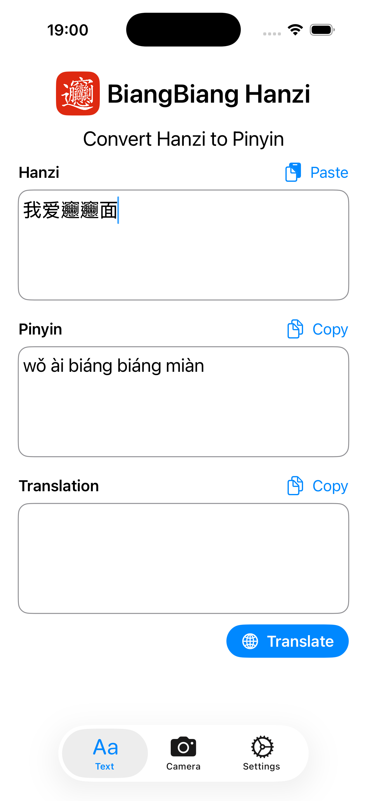
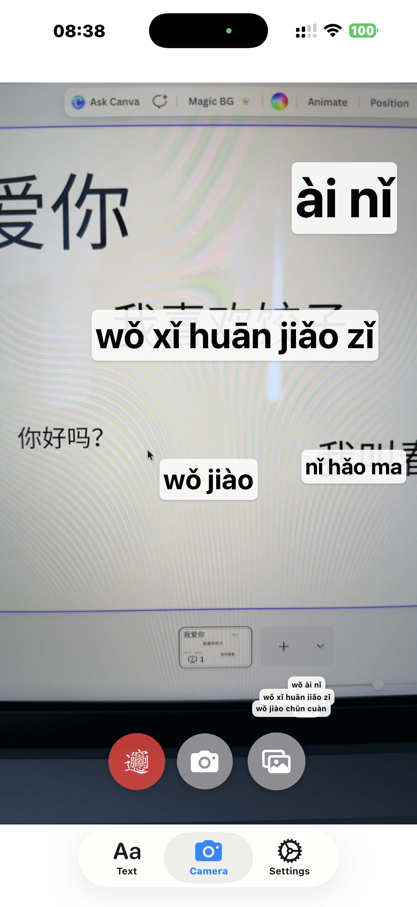
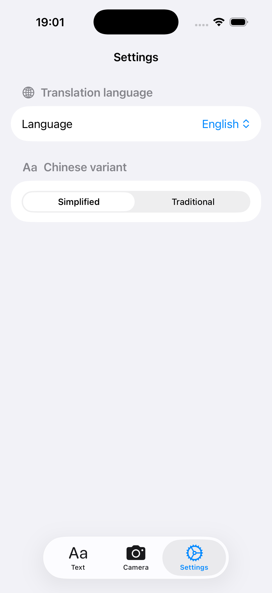

# Harakat حركات Lens


## Overview

Harakat Lens is an iOS and Android application that allows users to scan, transliterate, and translate Arabic text instantly using OCR. It targets Arabic learners, travelers, beginners approaching Arabic script, Quran readers, and anyone who cannot yet read Arabic fluently.

The app converts Arabic script into readable Latin transliteration and provides translation, with optional Quran-aware features. It supports both generic Arabic text and Quranic Arabic.

## Features

- [x] Scan Arabic text via live camera OCR
- [x] OCR from captured photos and imported images
- [x] Convert Arabic script to Latin transliteration
- [x] Translate Arabic text into any selected language
- [x] Quran verse recognition with structured metadata (planned)
- [ ] Audio recitation (planned)

## Download

Coming soon to the App Store and Google Play.


## Required Tools

- [`swiftformat`](https://github.com/nicklockwood/SwiftFormat) — required for formatting iOS Swift code. Install via Homebrew:

  ```bash
  brew install swiftformat
  ```

## iOS

Format code using

```bash
swiftformat ./ios
```

Run `swiftformat ./ios` whenever iOS code is modified.

## License

This project is licensed under the Elastic V2 license. See the [LICENSE](./LICENSE) file for details.

## Gallery

Convert Arabic to Latin transliteration and translate.



Recognize Arabic from live camera and convert to transliteration.



Configure preferences.


